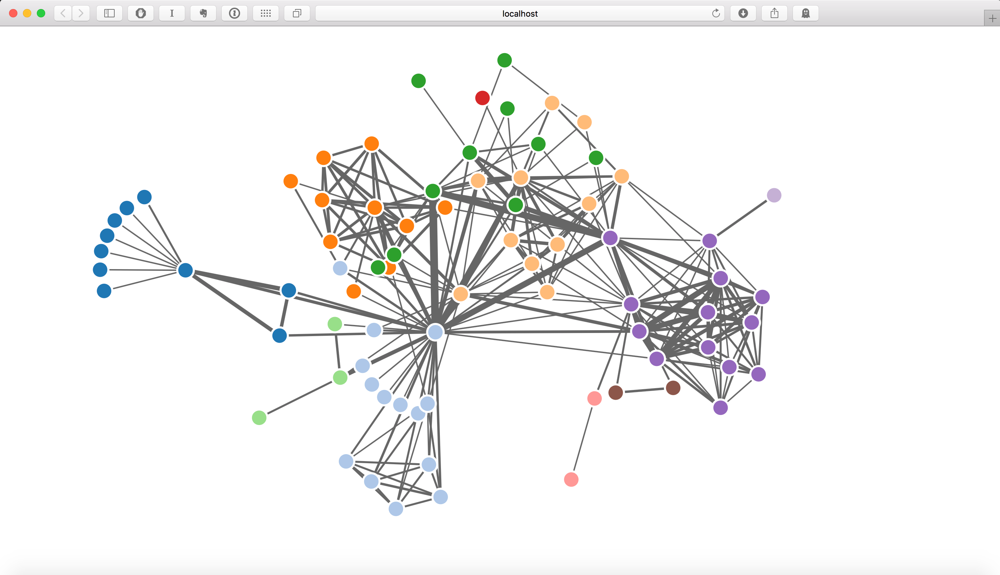
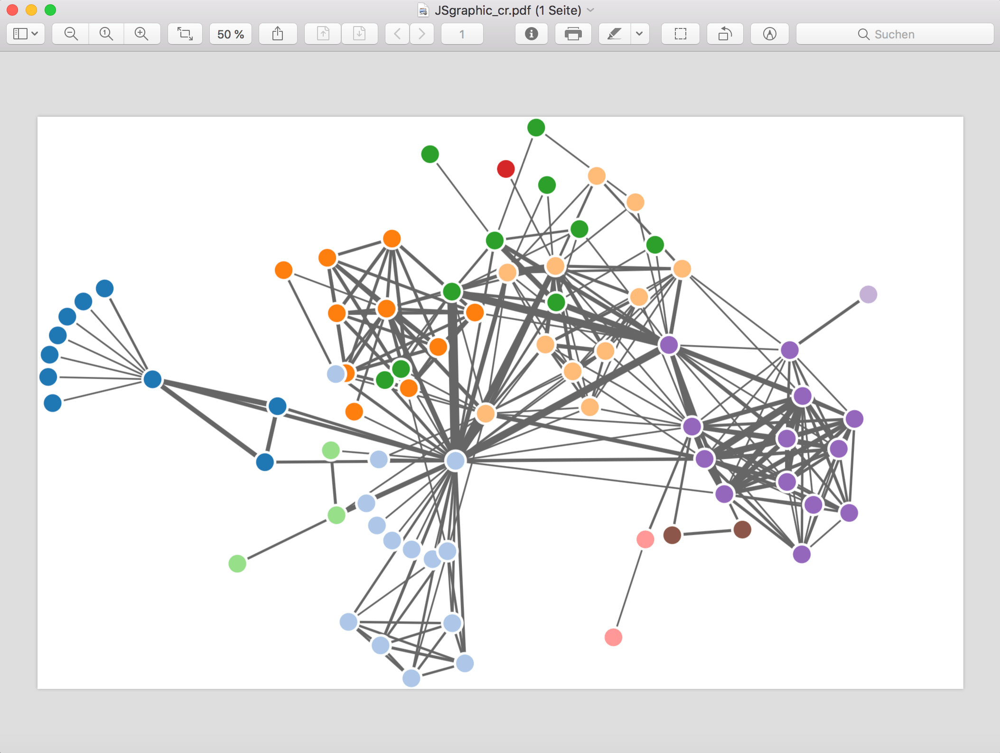

[](https://travis-ci.org/schmidtchristoph/js2graphic)

# js2graphic:
## Automatically saving JavaScript generated plots as graphics file
##### version 0.1.0

JavaScript (JS) data visualization libraries are made accessible in R by packages that are often based on the [htmlwidgets](http://www.htmlwidgets.org) package. These plotting packages produce figures generated by underlying executed JavaScript code. Thus, these figures are rendered and can be viewed in web browsers or the RStudio Viewer pane. The *js2graphic* package allows to easily and automatically save such figures as image files, like .jpg or .png, so that they can be reused, e.g. in publications or in presentations.


- - -
##### Save a JavaScript generated graphic as a cropped pdf *without* manually open it in a web browser first.

An example JavaScript graphic rendered in a web browser. This can be done with one click in RStudio after generating the plot using R. Now you could manually save the graphic or (gasp) make a screenshot of it. Better yet, use *js2graphic*. 


The same graphic as above, saved directly, without manual intervention, as a PDF file using this R package. Cropping of the right margin can be further adjusted by specifying the margin input parameters of the used *pdfcrop( )* function.


- - -
##### Functions

- *jsGraphic2Pdf( )*  -- Saving JS graphic as PDF
- *jsGraphic2Png( )*  -- Saving JS graphic as PNG
- *pdfcrop( )*        -- Cropping margins from the PDF figure
- *imagecrop( )*      -- Cropping margins from the PNG figure
- *pdfPageExtract( )* -- Extract a range of pages from a PDF file
- *svgFromHtml( )*    -- Extract svg graphic data from html/webarchive files

- - -
##### Usage


##### Case 1: Extracting an image from an already rendered JavaScript visualization that is stored as a web page in a html file

In the following example, the JavaScript graphic was rendered in Firefox and saved as a web page. The html file contains the graphic embedded as SVG. Using *svgFromHtml( )*, I saved this SVG code as a file in inst/extdata/alplots2_ff.svg for demonstration purposes. This SVG file can be edited in any vector graphics software.  

```r
path1 <- system.file("extdata/alplots2_ff.html", package = "js2graphic")
file.copy(path1, getwd())

jsGraphic2Pdf("alplots2_ff.html", c(950, 500, 40, 20)) # stores the JS graphic as pdf
pdfcrop("JSgraphic.pdf") # generates the final cropped pdf containing the JS generated plot

jsGraphic2Png(file, c(950, 500, 40, 20)) # stores the JS graphic as png
imagecrop("JSgraphic.png") # generates the final cropped png containing the JS generated plot

file.remove(c("alplots2_ff.html", "JSgraphic.pdf", "JSgraphic_cr.pdf", "JSgraphic.png", "JSgraphic_cr.png")) # remove all files after inspecting the final pdf and png
```

The shown alluvial plot itself was generated with a function based on a networkD3 sankey plot. It represents node flows between network modules (communities) over time.


##### Case 2: Use a html file that contains JavaScript code that was saved with htmlwidgets::saveWidget() 

The html file might contain JS code to generate an interactive visualization that is saved as a static image file.

```r
library(d3heatmap)
p <- d3heatmap(mtcars, scale = "column", colors = "Blues")

htmlwidgets::saveWidget(p, file = "heatmap.html", selfcontained = TRUE)

jsGraphic2Pdf("heatmap.html", c(2500, 2000, 50, 50))

pdfPageExtract("JSgraphic.pdf", 1, 1, "JSgraphic2.pdf") # removing the last 2 empty pages from JSgraphic.pdf

pdfcrop("JSgraphic2.pdf", "JSgraphic3.pdf", c(-30, -30, -70, -30)) # cropping with adding a little extra white margin to the automatic crop; JSgraphic3.pdf contains the final cropped figure

file.remove(c("heatmap.html", "JSgraphic.pdf", "JSgraphic2.pdf", "JSgraphic3.pdf"))
```

```r
path2 <- system.file("extdata/alluvial_js.html", package = "js2graphic")
file.copy(path2, getwd())

jsGraphic2Pdf("alluvial_js.html", c(1000, 500, 40, 20))
pdfcrop("JSgraphic.pdf")

jsGraphic2Png("alluvial_js.html", c(1000, 500, 40, 20))
imagecrop("JSgraphic.png")

file.remove(c("alluvial_js.html", "JSgraphic.pdf", "JSgraphic_cr.pdf",
             "JSgraphic.png", "JSgraphic_cr.png"))
```


##### Case 3: Using a generated graphic/plot object directly

E.g. the social network at https://christophergandrud.github.io/networkD3/

```r
library(networkD3)
data(MisLinks)
data(MisNodes)
p <- forceNetwork(Links = MisLinks, Nodes = MisNodes,
             Source = "source", Target = "target",
             Value = "value", NodeID = "name",
             Group = "group", opacity = 0.9,
             height = 900, width = 900)

jsGraphic2Pdf(p, c(900, 900, 20, 20), slow = TRUE) # longer rendering time so that the layout of the network fully unfolds
pdfcrop("JSgraphic.pdf")

jsGraphic2Png(p, c(900, 900, 20, 20), slow = TRUE)
imagecrop("JSgraphic.png")

file.remove(c("JSgraphic.pdf", "JSgraphic_cr.pdf",
            "JSgraphic.png", "JSgraphic_cr.png"))
```

Another example, taken from https://plot.ly/r/line-and-scatter/

```r
library(plotly)
p <- plot_ly(data=iris, x=~Sepal.Length, y=~Petal.Length, type="scatter", mode="markers")
jsGraphic2Pdf(p, c(1200, 1200, 0, 0), slow = FALSE)
pdfPageExtract("JSgraphic.pdf", 1, 1, "JSgraphic2.pdf") # removing the last 2 empty pages from JSgraphic.pdf

file.remove("JSgraphic.pdf", "JSgraphic2.pdf")
```


- - -

##### How to install this package from GitHub

There are several ways of installing the package, e.g.:

- install the "devtools" package first, then use
```devtools::install_github("schmidtchristoph/js2graphic")```

- install the "devtools" package first, clone the repository, then use
```devtools::install("path/to/repository/js2graphic")```

- - - 
##### System dependencies

The *js2graphic* functionality is based on [PhantomJS](http://phantomjs.org), [ImageMagick](http://www.imagemagick.org/), [Ghostscript](https://www.ghostscript.com) and [pdfcrop](https://www.ctan.org/pkg/pdfcrop?lang=en) (which is often shipped with LaTeX). These software tools have to be installed on your computer and have to be accessible on the command line.

Internally, this package uses JavaScript code published [here](https://github.com/ariya/phantomjs/blob/master/examples/rasterize.js).
- - -

This package passes ```devtools::check()``` with zero problems, notes or warnings on my machine running R 3.4.3 on macOS 10.13.5.

- - - 
The [MIT License (MIT)](http://opensource.org/licenses/MIT)
Copyright (c) 2018 Christoph Schmidt
